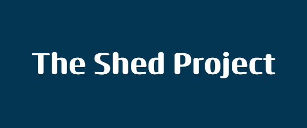

# The Shed Project

The Shed Project is centered around creating tools for devices.

## Table of Content (TOC)

 - [Project 1 - Audio Recorder](https://github.com/Fash-Mayor/The-Shed-Project?tab=readme-ov-file#audio-recorder)
 - [Project 2 - Mp4 to Mp3](https://github.com/Fash-Mayor/The-Shed-Project?tab=readme-ov-file#mp4-to-mp3-audio-extractor)
 - [Project 3 - Music Player](https://github.com/Fash-Mayor/The-Shed-Project?tab=readme-ov-file#music-player)
 - [Project 4 - PDF to Audio](https://github.com/Fash-Mayor/The-Shed-Project?tab=readme-ov-file#pdf-to-audio)
 - [Project 5 - Spotify Downloader](https://github.com/Fash-Mayor/The-Shed-Project?tab=readme-ov-file#spotify-downloader)
 - [Project 6](https://github.com/Fash-Mayor/The-Shed-Project?tab=readme-ov-file#project-6)
 - [Project 7](https://github.com/Fash-Mayor/The-Shed-Project?tab=readme-ov-file#project-7)
 - [Project 8](https://github.com/Fash-Mayor/The-Shed-Project?tab=readme-ov-file#project-8)
 - [Project 9](https://github.com/Fash-Mayor/The-Shed-Project?tab=readme-ov-file#project-9)
 - [Project 10](https://github.com/Fash-Mayor/The-Shed-Project?tab=readme-ov-file#project-10)

## Audio Recorder 
### Description
This project is about creating a tool for devices. The tool will be used to perform a specific task
### Code
python
python
python
### Project 1 Output

### Project 1 Explanation
This project is about creating a tool for devices. The tool will be used to perform a specific task
### Project 1 Conclusion
This project is about creating a tool for devices. The tool will be used to perform a specific task
### Project 1 Code Explanation
This project is about creating a tool for devices. The tool will be used to perform a specific task

## Mp4 to Mp3 (Audio Extractor)
### Project 2 Description
This project is about creating a tool for devices. The tool will be used to perform a specific task
### Project 2 Code
python
python
python
### Project 2 Output

### Project 2 Explanation
This project is about creating a tool for devices. The tool will be used to perform a specific task
### Project 2 Conclusion
This project is about creating a tool for devices. The tool will be used to perform a specific task
### Project 2 Code Explanation
This project is about creating a tool for devices. The tool will be used to perform a specific task

## Music Player
### Project 3 Description
This project is about creating a tool for devices. The tool will be used to perform a specific task
### Project 3 Code
python
python
python
### Project 3 Output

### Project 3 Explanation
This project is about creating a tool for devices. The tool will be used to perform a specific task
### Project 3 Conclusion
This project is about creating a tool for devices. The tool will be used to perform a specific task
### Project 3 Code Explanation
This project is about creating a tool for devices. The tool will be used to perform a specific task

## PDF to Audio
### Project 4 Description
This project is about creating a tool for devices. The tool will be used to perform a specific task
### Project 4 Code
python
python
python
### Project 4 Output

### Project 4 Explanation
This project is about creating a tool for devices. The tool will be used to perform a specific task
### Project 4 Conclusion
This project is about creating a tool for devices. The tool will be used to perform a specific task
### Project 4 Code Explanation
This project is about creating a tool for devices. The tool will be used to perform a specific task

## Spotify Downloader
### Project 5 Description
This project is about creating a tool for devices. The tool will be used to perform a specific task
### Project 5 Code
python
python
python
### Project 5 Output

### Project 5 Explanation
This project is about creating a tool for devices. The tool will be used to perform a specific task
### Project 5 Conclusion
This project is about creating a tool for devices. The tool will be used to perform a specific task
### Project 5 Code Explanation
This project is about creating a tool for devices. The tool will be used to perform a specific task

## Project 6
### Project 6 Description
This project is about creating a tool for devices. The tool will be used to perform a specific task
### Project 6 Code
python
python
python
### Project 6 Output

### Project 6 Explanation
This project is about creating a tool for devices. The tool will be used to perform a specific task
### Project 6 Conclusion
This project is about creating a tool for devices. The tool will be used to perform a specific task
### Project 6 Code Explanation
This project is about creating a tool for devices. The tool will be used to perform a specific task

## Project 7
### Project 7 Description
This project is about creating a tool for devices. The tool will be used to perform a specific task
### Project 7 Code
python
python
python
### Project 7 Output

### Project 7 Explanation
This project is about creating a tool for devices. The tool will be used to perform a specific task
### Project 7 Conclusion
This project is about creating a tool for devices. The tool will be used to perform a specific task
### Project 7 Code Explanation
This project is about creating a tool for devices. The tool will be used to perform a specific task

## Project 8
### Project 8 Description
This project is about creating a tool for devices. The tool will be used to perform a specific task
### Project 8 Code
python
python
python
### Project 8 Output

### Project 8 Explanation
This project is about creating a tool for devices. The tool will be used to perform a specific task
### Project 8 Conclusion
This project is about creating a tool for devices. The tool will be used to perform a specific task
### Project 8 Code Explanation
This project is about creating a tool for devices. The tool will be used to perform a specific task

## Project 9
### Project 9 Description
This project is about creating a tool for devices. The tool will be used to perform a specific task
### Project 9 Code
python
python
python
### Project 9 Output

### Project 9 Explanation
This project is about creating a tool for devices. The tool will be used to perform a specific task
### Project 9 Conclusion
This project is about creating a tool for devices. The tool will be used to perform a specific task
### Project 9 Code Explanation
This project is about creating a tool for devices. The tool will be used to perform a specific task

## Project 10
### Project 10 Description
This project is about creating a tool for devices. The tool will be used to perform a specific task
### Project 10 Code
python
python
python
### Project 10 Output

### Project 10 Explanation
This project is about creating a tool for devices. The tool will be used to perform a specific task
### Project 10 Conclusion
This project is about creating a tool for devices. The tool will be used to perform a specific task
### Project 10 Code Explanation
This project is about creating a tool for devices. The tool will be used to perform a specific task
